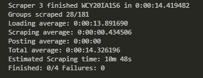
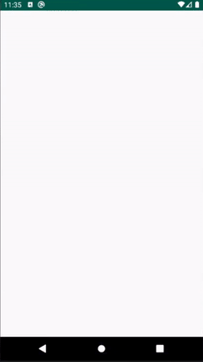
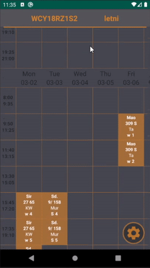

# WAT Plan
---
### *WAT Plan* is a full stack project of my university's departament of cybernetics schedule
  * ## Obtaining data   
    Scraper is a *Selenium* based bot, which uses *BeautifulSoup* to get and parse data from the departaments service,   
    in order to post the data to the web service described below afterwards.
  
    Scrapers are organised by ScrapeSquad class, which runs multple instances of them on separate threads and gathers information about progress of scraping. 
    
    
    
  * ## Transfering data to the app
    To enable *WAT Plan* android app to get the desired data, I created a simple *Django* web service.   
    The service keeps track of any changes in the schedules posted to itself by scraping bots, so that *WAT Plan* is always up to date.
    
  * ## The android app itself
    It obtains data from the web service, and saves it to local sqlite storage, so that it is possible to acces previously visited schedules offline. Each time any schelude of a group is requested to open, app checks if its local version matches the one stored in the service's database.   
    
    |first startup|changing filters|
    |---|---|
    |||
